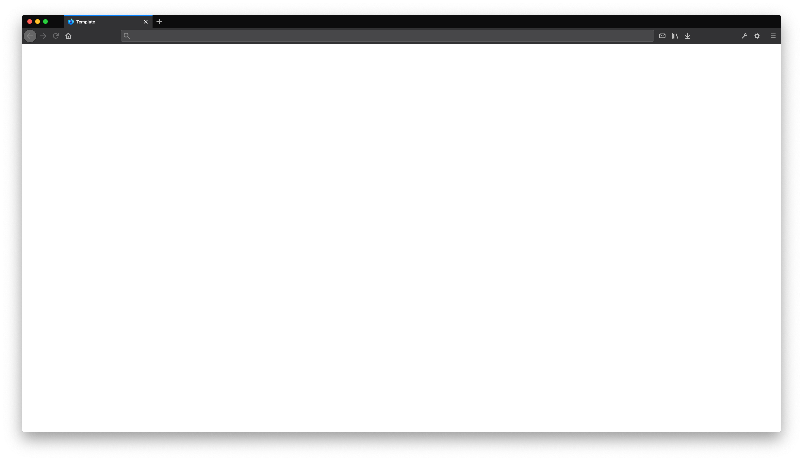

# Product Name

Maecenas sed diam eget risus varius blandit sit amet non magna. Vivamus sagittis lacus vel augue laoreet rutrum faucibus dolor auctor. Nullam quis risus eget urna mollis ornare vel eu leo. Integer posuere erat a ante venenatis dapibus posuere velit aliquet. Duis mollis, est non commodo luctus, nisi erat porttitor ligula, eget lacinia odio sem nec elit.

### Contacts
| Manager                                  | Designer                                 | Frontend Developer                       | Backend Developer                        |
| :--------------------------------------- | :--------------------------------------- | :--------------------------------------- | :--------------------------------------- |
| [@username](https://github.com/username) | [@username](https://github.com/username) | [@username](https://github.com/username) | [@username](https://github.com/username) |

## Contents
  * [Motivation](#motivation)
  * [Stories](#stories)
  * [Workflow](#workflow)
  * [Requirements](#requirements)
  * [Goals](#goals)
  * [Metrics](#metrics)
  * [Roadmap](#roadmap)

## Motivation
Etiam porta sem malesuada magna mollis euismod. Vestibulum id ligula porta felis euismod semper. Donec id elit non mi porta gravida at eget metus. Aenean lacinia bibendum nulla sed consectetur.

  * Lorem ipsum dolor sit amet, consectetur adipiscing elit
  * Vivamus sagittis lacus vel augue laoreet rutrum faucibus dolor auctor
  * Nullam id dolor id nibh ultricies vehicula ut id elit
  * Curabitur blandit tempus porttitor
  * Aenean eu leo quam

### Who is this for?
Maecenas faucibus mollis interdum. Vestibulum id ligula porta felis euismod semper. Morbi leo risus, porta ac consectetur ac, vestibulum at eros. Cras justo odio, dapibus ac facilisis in, egestas eget quam.

### What need does this fill?
Curabitur blandit tempus porttitor. Nullam quis risus eget urna mollis ornare vel eu leo. Cras justo odio, dapibus ac facilisis in, egestas eget quam. Aenean lacinia bibendum nulla sed consectetur. Integer posuere erat a ante venenatis dapibus posuere velit aliquet.

### How does this benefit the organization?
Praesent commodo cursus magna, vel scelerisque nisl consectetur et. Nullam id dolor id nibh ultricies vehicula ut id elit. Nulla vitae elit libero, a pharetra augue. Aenean eu leo quam. Pellentesque ornare sem lacinia quam venenatis vestibulum. Nullam id dolor id nibh ultricies vehicula ut id elit. Etiam porta sem malesuada magna mollis euismod. Integer posuere erat a ante venenatis dapibus posuere velit aliquet.

## Stories

### [Story A](stories/STORY.md)
Cum sociis natoque penatibus et magnis dis parturient montes, nascetur ridiculus mus. Lorem ipsum dolor sit amet, consectetur adipiscing elit. Cum sociis natoque penatibus et magnis dis parturient montes, nascetur ridiculus mus. Aenean lacinia bibendum nulla sed consectetur. Morbi leo risus, porta ac consectetur ac, vestibulum at eros. Aenean lacinia bibendum nulla sed consectetur. [Read full story →](stories/STORY.md)

### [Story B](stories/STORY.md)
Nulla vitae elit libero, a pharetra augue. Fusce dapibus, tellus ac cursus commodo, tortor mauris condimentum nibh, ut fermentum massa justo sit amet risus. Sed posuere consectetur est at lobortis. Sed posuere consectetur est at lobortis. Nullam quis risus eget urna mollis ornare vel eu leo. Fusce dapibus, tellus ac cursus commodo, tortor mauris condimentum nibh, ut fermentum massa justo sit amet risus. [Read full story →](stories/STORY.md)

### [Story C](stories/STORY.md)
Maecenas sed diam eget risus varius blandit sit amet non magna. Vivamus sagittis lacus vel augue laoreet rutrum faucibus dolor auctor. Maecenas faucibus mollis interdum. Vivamus sagittis lacus vel augue laoreet rutrum faucibus dolor auctor. Donec sed odio dui. Vivamus sagittis lacus vel augue laoreet rutrum faucibus dolor auctor. [Read full story →](stories/STORY.md)

## Requirements
Cum sociis natoque penatibus et magnis dis parturient montes, nascetur ridiculus mus. Cras mattis consectetur purus sit amet fermentum. Donec ullamcorper nulla non metus auctor fringilla. Nulla vitae elit libero, a pharetra augue. Vestibulum id ligula porta felis euismod semper.

  * Aenean lacinia bibendum nulla sed consectetur
  * Lorem ipsum dolor sit amet, consectetur adipiscing elit
  * Aenean eu leo quam
  * Pellentesque ornare sem lacinia quam venenatis vestibulum
  * Morbi leo risus, porta ac consectetur ac, vestibulum at eros

## Goals
Duis mollis, est non commodo luctus, nisi erat porttitor ligula, eget lacinia odio sem nec elit. Maecenas sed diam eget risus varius blandit sit amet non magna. Nullam quis risus eget urna mollis ornare vel eu leo. Morbi leo risus, porta ac consectetur ac, vestibulum at eros. Etiam porta sem malesuada magna mollis euismod. Aenean eu leo quam. Pellentesque ornare sem lacinia quam venenatis vestibulum. Cum sociis natoque penatibus et magnis dis parturient montes, nascetur ridiculus mus.

## Metrics
Aenean eu leo quam. Pellentesque ornare sem lacinia quam venenatis vestibulum. Cum sociis natoque penatibus et magnis dis parturient montes, nascetur ridiculus mus. Donec sed odio dui. Cras justo odio, dapibus ac facilisis in, egestas eget quam.

## Roadmap
Nullam id dolor id nibh ultricies vehicula ut id elit. Donec ullamcorper nulla non metus auctor fringilla. Cum sociis natoque penatibus et magnis dis parturient montes, nascetur ridiculus mus. Donec ullamcorper nulla non metus auctor fringilla. Vivamus sagittis lacus vel augue laoreet rutrum faucibus dolor auctor. Aenean eu leo quam. Pellentesque ornare sem lacinia quam venenatis vestibulum.

### Current
  * [x] Complete item
  * [ ] Incomplete item

### Near Term
  * [x] Complete item
  * [ ] Incomplete item

### Long Term
  * [x] Complete item
  * [ ] Incomplete item
