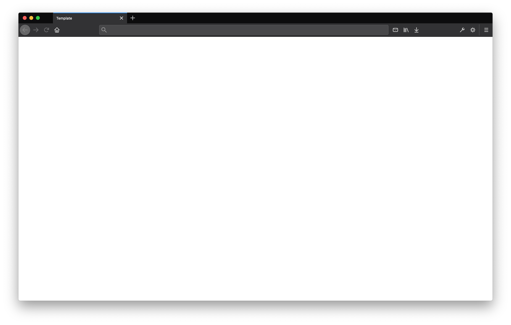

# Product Name

The executive summary of the product, what user problem it solves, how it works and why it is needed.

## Contents
  * [Motivation](#motivation)
  * [Stories](#stories)
    * [Story A](stories/STORY.md)
  * [Workflow](#workflow)
  * [Requirements](#requirements)
  * [Goals](#goals)
  * [Metrics](#metrics)
  * [Roadmap](#roadmap)
  * [Discussion](#discussion)

## Motivation
The **why** behind the product proposal. Why are we proposing this? Does it fit within our organizational mission and values? Does it endear trust?

*If the "why" isn't clear, perhaps neither is the product.*

### Who is this for?
The user segment who benefits from the product.

### What need does this solve?
Justification outlining why the product warrants organizational time and effort.

### How is the organization impacted?
Postulation regarding how the product will affect the organization. Be it financially, socially or otherwise.

## Stories
The narratives of the different user journeys served by the product.

### [Story A](stories/STORY.md)
Summary of a singular user story for the product. [Read full story →](stories/STORY.md)

## Requirements
The staff, resources, technologies, etc. that would be needed to successfully implement the product.

## Goals
The expected outcome of the product should be. What does success for the product look like.

## Metrics
What can be tracked within the product to measure the successes outlined in Goals. How will these metrics be analyzed?

## Roadmap
The fully featured product timeline. What gets the product to MVP? What would make it good? What would make it great?

### Current
  * [x] Complete item
  * [ ] Incomplete item

### Near Term
  * [x] Complete item
  * [ ] Incomplete item

### Long Term
  * [x] Complete item
  * [ ] Incomplete item

## Discussion
Discussion around this brief can be found in the [#example](https://organization.slack.com/) Slack channel. For questions and support please reach out to the designated contacts below.

| Manager                                  | Designer                                 | Developer                                |
| :--------------------------------------- | :--------------------------------------- | :--------------------------------------- |
| [@username](https://github.com/username) | [@username](https://github.com/username) | [@username](https://github.com/username) |
